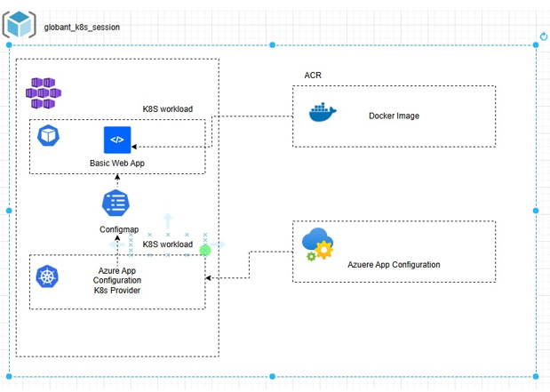

# AKS-App Configuration Setting

This repository contains steps to integrate Azure App Configuration with an AKS cluster that has Azure AD authentication enabled.

## Prerequisites  
- **Resources Needed:**  
  - AKS cluster with Azure AD authentication enabled  
  - Azure App Configuration  
  - User Managed Identity  

---

## Steps  

### 1. Install the Azure App Configuration Kubernetes Provider  

#### Using Helm:  
Install the Azure App Configuration Kubernetes Provider to your AKS cluster using Helm:  
```bash  
helm install azureappconfiguration.kubernetesprovider \
    oci://mcr.microsoft.com/azure-app-configuration/helmchart/kubernetes-provider \
    --namespace azappconfig-system \
    --create-namespace

#### azure CLI:
az k8s-extension create --cluster-type managedClusters \
    --cluster-name myAKSCluster \
    --resource-group myResourceGroup \
    --name appconfigurationkubernetesprovider \
    --extension-type Microsoft.AppConfiguration  

# Azure App Configuration Provider Setup

This guide walks you through setting up the `appConfigurationProvider.yaml` file, which allows your Kubernetes cluster to fetch data from Azure App Configuration and create a ConfigMap based on it.

## Overview

The `appConfigurationProvider.yaml` file defines an `AzureAppConfigurationProvider` resource. This resource connects your Kubernetes cluster to Azure App Configuration using a managed identity for authentication. It retrieves configuration data and creates a ConfigMap in the cluster based on the data from the App Configuration store.

## Prerequisites

Before proceeding, ensure the following:

1. **Azure App Configuration Store**: You have an existing Azure App Configuration store.
2. **Managed Identity**: A managed identity (User Managed Identity) with the appropriate Azure RBAC role is available. The identity should have the **App Configuration Data Reader** role assigned.
3. **Kubernetes Cluster**: A running Kubernetes cluster with the Azure App Configuration Provider operator installed.

## Steps

### 1. Create `appConfigurationProvider.yaml`

Add the following content to the `appConfigurationProvider.yaml` file in your deployment directory:

```yaml
apiVersion: azconfig.io/v1
kind: AzureAppConfigurationProvider
metadata:
  name: appconfigurationprovider-sample
spec:
  endpoint: <your-app-configuration-store-endpoint>
  target:
    configMapName: configmap-created-by-appconfig-provider
  auth:
    managedIdentityClientId: <your-managed-identity-client-id>

### Add Key-Values in Azure App Configuration
Log in to your Azure portal and add the required key-value pairs to your Azure App Configuration instance.

//Refer to the manifest4 folder in this repository for sample manifests and configuration files.
