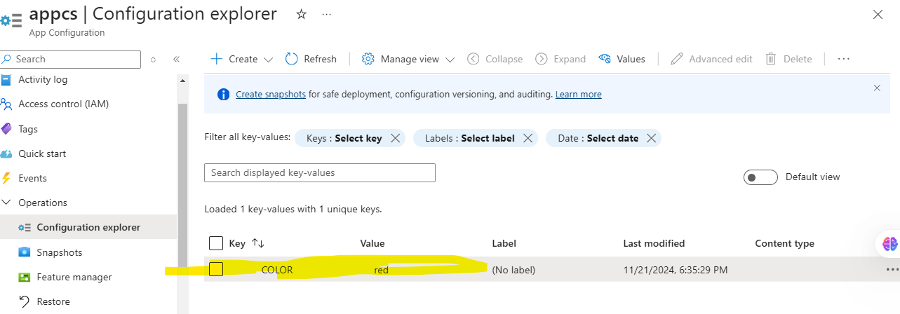

# App Configuration and AKS integration for using configmaps and secrets in k8s

This repository contains steps to integrate Azure App Configuration with an AKS cluster that has Azure AD authentication enabled.

## Prerequisites  
- **Resources Needed:**  
  - AKS cluster with Azure AD authentication enabled  
  - Azure App Configuration  
  - User Managed Identity  
  - Key Vault

## Architecture Diagram  


## Steps  

### 1. Install the Azure App Configuration Kubernetes Provider  

#### Using Helm:  
  Install the Azure App Configuration Kubernetes Provider to your AKS cluster using Helm:  
  ```bash  
  helm install azureappconfiguration.kubernetesprovider \
    oci://mcr.microsoft.com/azure-app-configuration/helmchart/kubernetes-provider \
    --namespace azappconfig-system \
    --create-namespace
 ```
#### Using Azure CLI:
```bash
az k8s-extension create --cluster-type managedClusters \
    --cluster-name myAKSCluster \
    --resource-group myResourceGroup \
    --name appconfigurationkubernetesprovider \
    --extension-type Microsoft.AppConfiguration  
 ```

### 2. Update the values in  "manifest4/azure-app-configuration-provider.yaml"

The `appConfigurationProvider.yaml` file defines an `AzureAppConfigurationProvider` resource. This resource connects your Kubernetes cluster to Azure App Configuration using a managed identity for authentication. It retrieves configuration data and creates a ConfigMap in the cluster based on the data from the App Configuration store.

```yaml
apiVersion: azconfig.io/v1
kind: AzureAppConfigurationProvider
metadata:
  name: appconfigurationprovider-sample
spec:
  endpoint: <App-Configendpoint>
  target:
    configMapName: configmap-created-by-appconfig-provider
    configMapData: 
      type: default
    secret:
      target:
        secretName: COLOR
  auth:
    managedIdentityClientId: <ManagedIdentityClientID>
```
### 3. Add Key-Values in Azure App Configuration
Log in to your Azure portal and add the required key-value pairs to your Azure App Configuration instance.

'''
add key COLOR = red 
'''


### 4. Deploy the application on the AKS Cluster
```bash
 kubectl create ns appconfig-demo
```
```bash
 kubectl apply -f manifest4 -n appconfig-demo
```


### 4. Check the output
Run below commands to check the status of the pods and service

```bash
 kubectl get pods -n appconfig-demo
```
```bash
 kubectl get svc -n appconfig-demo
```
Check if the configmap is created or not
```bash
 kubectl get configmaps -n appconfig-demo
```
 Check the output with external Ip Address of svc


#### Change key value COLOR to blue in app configuration and check the output

```bash
 kubectl get configmaps -n appconfig-demo
```
```bash
kubectl delete configmaps 
configmap-created-by-appconfig-provider -n appconfig-demo
```
>//Once you delete the configmaps , new configmap will create automatically with updated values

> Restrat the pods
```bash
 kubectl delete pod <podname> -n appconfig-demo
```
```bash
 kubectl get svc -n appconfig-demo
```
|  |  |
|:-------------------------------------:|:----------------------------------------:|
|            App Config    |         Output 

## Managing the Secrets in the AKS using the App Configuration

Now we will pass the value of COLOR as a secret.

### Steps
### 1. add the secret in key vault


### 2. add the key value reference in the app configuration

|  |  |  |
|-------------------------|-----------------------------------|-------------------------|

### 3.Check the output
```bash
 kubectl get pods -n appconfig-demo
```
```bash
 kubectl get svc -n appconfig-demo
```
Check if the configmap is created or not
```bash
 kubectl get secrets -n appconfig-demo
```
```bash
 kubectl delete pod <podname> -n appconfig-demo
```
 Check the output with external Ip Address of svc

 

 ## Troubleshooting
 

>RESPONSE 403: 403 Forbidden: The configured identity lacks the necessary permissions to access the App Configuration store. Refer to the Authentication section for examples that match the identity you are using.

>A Key Vault reference is found in App Configuration, but 'spec.secret' was not configured: One or more Key Vault references are included in the selected key-values, but the authentication information for Key Vaults is not provided. To maintain the integrity of the configuration, the entire configuration fails to load. Configure the spec.secret section to provide the necessary authentication information.
